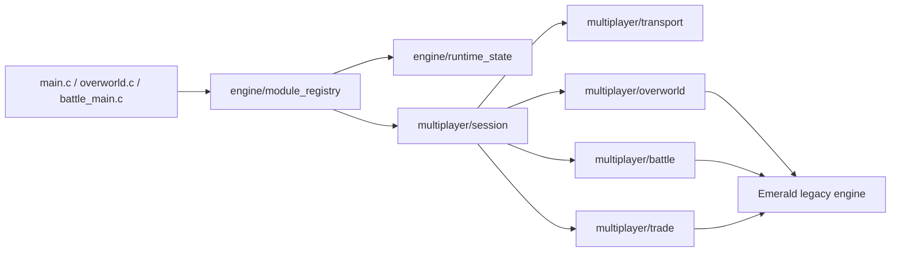

# pokeemerald-rebuilt

<!-- last_updated: 2026-05-15 -->

[](https://github.com/thomaspophomas/pokeemerald-rebuilt/actions/workflows/build.yml)

Mod-first Pokemon Emerald decomp project. The current direction is to keep the
classic Emerald build working while introducing clean module boundaries for
large features: online overworld multiplayer, battle subsessions, trading,
runtime weather/time/follower systems, and compile-time engine rule sets.

This repository is based on the public Pokemon Emerald decompilation layout.
It does not distribute a built ROM in releases or CI artifacts.

## TL;DR

- Base game: Pokemon Emerald decomp-style source tree.
- Current architecture work: multiplayer-first modular refactor.
- Overworld target: up to 8 online players in one session.
- Battle target: up to 2 human players in PvE and up to 4 human players in
  2v2 PvP.
- Battles and trades are subsessions, so uninvolved players stay in the
  overworld.
- Build-time feature gate: `FEATURE_MULTIPLAYER=1`.
- Runtime-safe feature state starts in `engine/runtime_state`; SaveBlock
  persistence is a later migration pass.

## Architecture



New features should attach through module hooks and ports instead of spreading
direct reads of legacy globals through feature code. The initial hooks are:

- `Init`
- `Frame`
- `MapLoad`
- `PlayerStep`
- `BattleStart`
- `BattleEnd`

## Setup

Follow [INSTALL.md](INSTALL.md) for toolchain setup.

Typical Linux/macOS build:

```bash
make -j"$(nproc)"
make -j"$(nproc)" modern
```

Enable the multiplayer architecture layer:

```bash
make -j"$(nproc)" modern FEATURE_MULTIPLAYER=1
```

Enable autoconnect for emulator-bridge experiments:

```bash
make -j"$(nproc)" modern FEATURE_MULTIPLAYER=1 FEATURE_MULTIPLAYER_AUTOCONNECT=1
```

## CI/CD

The GitHub Actions pipeline runs on pull requests, pushes to `master`, manual
dispatch, and version tags.

Jobs:

- Documentation structure check for `README.md`, `AGENTS.md`, and `CLAUDE.md`.
- Architecture guard for multiplayer module boundaries.
- Vanilla compare build plus `.sym` generation.
- Modern builds with `FEATURE_MULTIPLAYER=0` and `FEATURE_MULTIPLAYER=1`.
- Non-modern feature build with `FEATURE_MULTIPLAYER=1` and `COMPARE=0`.
- Symbol branch update on pushes to `master`.
- Source-only GitHub release creation on `v*` tags.

CI intentionally does not upload built ROM artifacts.

## Module Conventions

- Compile-time feature gates live in `include/config/features.h`.
- Runtime-safe settings live behind a versioned state API.
- Multiplayer transport details stay inside `src/multiplayer/transport_*`.
- Multiplayer supports 8 network players, but battles map only the active
  subsession into Emerald's 4-battler structure.
- Do not expand SaveBlock layouts, `struct Pokemon`, `struct ObjectEvent`, or
  `struct LinkPlayer` casually. Add a documented migration pass first.
- Keep code compatible with the repo's C style and GBA toolchain constraints.

## Discovery Order

1. [AGENTS.md](AGENTS.md) or [CLAUDE.md](CLAUDE.md) for AI-agent rules.
2. [docs/modular_multiplayer_architecture.md](docs/modular_multiplayer_architecture.md)
   for the current refactor boundary.
3. `include/config/features.h` for build-time feature gates.
4. `include/engine/` and `src/engine/` for module hooks and runtime state.
5. `include/multiplayer/` and `src/multiplayer/` for session, transport,
   overworld, battle, and trade APIs.
6. `INSTALL.md` for toolchain setup.

## References

- [pret/pokeemerald](https://github.com/pret/pokeemerald)
- [pokeemerald-expansion](https://github.com/rh-hideout/pokeemerald-expansion)
- [hamham240/poke-emerald-online](https://github.com/hamham240/poke-emerald-online)
