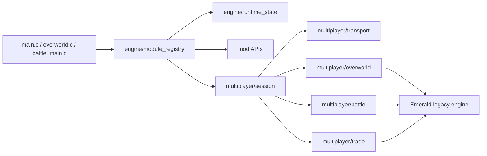

# pokeemerald-rebuilt

<!-- last_updated: 2026-05-16 -->

[](https://github.com/thomaspophomas/pokeemerald-rebuilt/actions/workflows/build.yml)

Mod-first Pokemon Emerald decomp project. The current direction is to keep the
classic Emerald build working while introducing clean module boundaries for
large features: online overworld multiplayer, battle subsessions, trading,
runtime weather/time/follower systems, and compile-time engine rule sets.

This repository is based on the public Pokemon Emerald decompilation layout.
It does not distribute a built ROM in releases or CI artifacts.

## TL;DR

- Base game: Pokemon Emerald decomp-style source tree.
- Current architecture work: multiplayer-first modular refactor.
- Overworld target: up to 8 online players in one session.
- Battle target: up to 2 human players in PvE and up to 4 human players in
  2v2 PvP.
- Battles and trades are subsessions, so uninvolved players stay in the
  overworld.
- Build-time feature gate: `FEATURE_MULTIPLAYER=1`.
- Emulator bridge transport is opt-in with
  `FEATURE_MULTIPLAYER_EMULATOR_TRANSPORT=1`.
- Multiplayer defaults to Solo and can be switched to Online in-game through
  Options or the Start menu when `FEATURE_MULTIPLAYER=1`.
- Online server profiles are save-backed mod state. The ROM publishes the
  selected IPv4/port profile to the local emulator bridge; the bridge owns the
  actual TCP/Tailscale connection to the authoritative server. Options exposes
  three slots plus an IP-octet/port editor.
- Runtime-safe feature state starts in `engine/runtime_state`; the
  Solo/Online choice is persisted in existing SaveBlock2 option padding and
  guarded by a fixed-size assertion.
- Mod APIs are generated from `mods/<modId>/...` by `scripts/modgen.py`.
  Weather, time, events, flags, sprites, language text, Pokeballs, engine
  rulesets, NPCs, and maps now have dedicated adapter APIs.

## Architecture



New features should attach through module hooks and ports instead of spreading
direct reads of legacy globals through feature code. The initial hooks are:

- `Init`
- `Frame`
- `MapLoad`
- `PlayerStep`
- `BattleStart`
- `BattleEnd`

## Setup

Follow [INSTALL.md](INSTALL.md) for toolchain setup.

Typical Linux/macOS build:

```bash
make -j"$(nproc)"
make -j"$(nproc)" modern
```

Enable the multiplayer architecture layer:

```bash
make -j"$(nproc)" modern FEATURE_MULTIPLAYER=1
```

Enable emulator-bridge experiments explicitly:

```bash
make -j"$(nproc)" modern FEATURE_MULTIPLAYER=1 FEATURE_MULTIPLAYER_EMULATOR_TRANSPORT=1
```

Enable autoconnect only when the emulator bridge is present:

```bash
make -j"$(nproc)" modern FEATURE_MULTIPLAYER=1 FEATURE_MULTIPLAYER_EMULATOR_TRANSPORT=1 FEATURE_MULTIPLAYER_AUTOCONNECT=1
```

Generate mod registries explicitly when working on manifests:

```bash
python3 scripts/modgen.py --root .
```

## CI/CD

The GitHub Actions pipeline runs on pull requests, pushes to `master` and
`codex/**`, manual dispatch, and version tags.

Jobs:

- Documentation structure check for `README.md`, `AGENTS.md`, and `CLAUDE.md`.
- Architecture guard for multiplayer module boundaries.
- Host-side multiplayer fuzz checks for snapshot, packet, and range invariants.
- Host-side multiplayer simulator checks for duplicate/retry/rollback safety.
- Multiplayer net-manifest check for protocol/build/bridge allowlist drift.
- Mod generator smoke test for generated registries and mod source discovery.
- Reference multiplayer bridge syntax and memory-layout smoke checks.
- Vanilla compare build plus `.sym` generation.
- Modern builds with `FEATURE_MULTIPLAYER=0`, `FEATURE_MULTIPLAYER=1`, and
  an explicit emulator-transport variant.
- Non-modern feature build with `FEATURE_MULTIPLAYER=1`, explicit
  emulator-transport coverage, and `COMPARE=0`.
- Symbol branch update on pushes to `master`.
- Source-only GitHub release creation on `v*` tags.

CI intentionally does not upload built ROM artifacts.

## Module Conventions

- Compile-time feature gates live in `include/config/features.h`.
- Mod manifests live under `mods/<modId>/...`; generated registries are build
  outputs and should not be edited by hand.
- New mod-facing systems should expose ports in `include/mod/` and keep raw
  Emerald globals inside one adapter file per domain.
- Use `ModFlag_*` for mod/story flags. Raw `FlagSet`, `FlagClear`, and
  `FlagGet` are legacy/adapter-only for new module code.
- Use `ModWeather_*` to resolve displayed weather and weather layers. Raw
  weather state belongs in the weather adapter.
- Use `ModTime_*` for day/night and daily events so online play can use server
  time while offline play falls back to RTC.
- Use `ModEvent_Emit` for cross-module hooks instead of direct module coupling.
- Use `SpriteAssetApi_*`, `OverworldSpriteApi_*`, and `BattleSpriteApi_*` for
  mod-owned sprite resources, map avatars, followers, battle assets, and ball
  graphics.
- Use `LanguageApi_*` for mod-facing text keys and language fallback.
- Use `PokeBallApi_*` for catch modifiers, throw results, catch commits, and
  battle ball graphics.
- Use `NpcApi_*` and `MapApi_*` for new NPC/map-facing code.
- Engine generation or custom rules belong behind `EngineApi_*` rulesets.
- Runtime-safe settings live behind a versioned state API.
- UI code may switch Solo/Online only through `engine/runtime_state` and
  `MultiplayerSession_*`; it must not call transport adapters directly.
- Multiplayer transport details stay inside `src/multiplayer/transport_*`.
- Emulator transport must remain opt-in and must validate bridge data before
  it reaches session state.
- Emulator bridge reads consume only the authoritative server view; the client
  writes only its local snapshot/output lane.
- Online protocol state is epoch based. `sessionEpoch`, `playerToken`,
  `joinNonce`, heartbeat, and build/ruleset manifest checks are required so
  save states, rewind, frame advance, and mismatched builds cannot silently
  mutate online state.
- Client data is untrusted online. Movement, interactions, battle actions,
  trade actions, time events, inventory, party, flags, money, and rewards must
  be server-validated before any online commit.
- Gameplay side effects must be idempotent. Online trade, item, party, story,
  outfit, reward, and battle-result changes go through `MultiplayerCommit_*`
  and currently fail closed until a server mirror owns those domains.
- Reliable action packets use a bounded bridge ring buffer; snapshots remain
  latest-wins.
- Reliable gameplay actions are retained in a bounded pending-transaction table
  and retried until ack/CommitResult, timeout, rollback, or resync.
- `ClientHello` requires `ServerHelloAck`; the ROM retries the hello instead of
  treating a queued packet as a completed handshake.
- NPC/script interactions are policy-gated online. Unknown targets are
  exclusive and wait for a server lock grant; mod NPCs may opt into
  `SHARED_READONLY` for harmless parallel dialog.
- Online time-sensitive systems must use `MultiplayerClock_*` and
  server-provided time; local RTC stays an offline compatibility fallback.
- Multiplayer overworld ticks are gated to real overworld callbacks so menus,
  battle callbacks, warps, and map-load gaps do not publish unsafe snapshots.
- Remote overworld players are rendered as non-colliding virtual objects; do
  not spawn them as normal `ObjectEvent`s. Their virtual IDs are reserved in
  the high range and guarded at compile time.
- Multiplayer supports 8 network players, but battles map only the active
  subsession into Emerald's 4-battler structure.
- Do not expand SaveBlock layouts, `struct Pokemon`, `struct ObjectEvent`, or
  `struct LinkPlayer` casually. Add a documented migration pass first.
- Keep code compatible with the repo's C style and GBA toolchain constraints.

## Discovery Order

1. [AGENTS.md](AGENTS.md) or [CLAUDE.md](CLAUDE.md) for AI-agent rules.
2. [docs/modular_multiplayer_architecture.md](docs/modular_multiplayer_architecture.md)
   for the current refactor boundary.
3. `include/config/features.h` for build-time feature gates.
4. `include/engine/` and `src/engine/` for module hooks and runtime state.
5. `include/mod/` and `src/mod/` for mod-facing APIs and adapters.
6. `include/multiplayer/` and `src/multiplayer/` for session, transport,
   overworld, battle, and trade APIs.
7. `INSTALL.md` for toolchain setup.

## References

- [pret/pokeemerald](https://github.com/pret/pokeemerald)
- [pokeemerald-expansion](https://github.com/rh-hideout/pokeemerald-expansion)
- [hamham240/poke-emerald-online](https://github.com/hamham240/poke-emerald-online)
