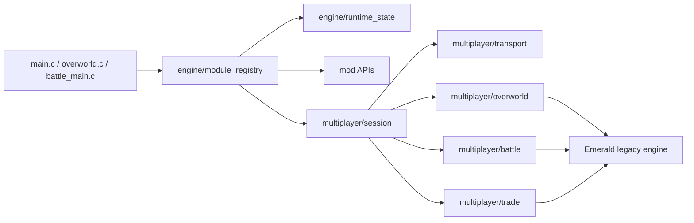

# pokeemerald-rebuilt

<!-- last_updated: 2026-05-22 -->

[](https://github.com/thomaspophomas/pokeemerald-rebuilt/actions/workflows/build.yml)

Mod-first Pokemon Emerald decomp project. The current direction is to keep the
classic Emerald build working while introducing clean module boundaries for
large features: online overworld multiplayer, battle subsessions, trading,
runtime weather/time/follower systems, and compile-time engine rule sets.

This repository is based on the public Pokemon Emerald decompilation layout.
It does not distribute a built ROM in releases or CI artifacts.

## Current Status

As of the 2026-05-22 local audit, this repository's `master` branch is aligned
with `origin/master` at `2776fe04a` ("Harden badge effect API and catalog
schema"). The current working tree also carries an uncommitted multiplayer/mod
API expansion that updates the runtime-profile and mod-catalog schema to
`0x00000006`.

Locally verified in this working tree:

- `python3 scripts/ci/check_net_manifest.py`
- `python3 scripts/ci/modgen_smoke.py`
- `python3 scripts/ci/multiplayer_host_sim.py`
- `python3 scripts/ci/multiplayer_fuzz.py`
- `make -j2 modern FEATURE_MULTIPLAYER=1 FEATURE_MULTIPLAYER_EMULATOR_TRANSPORT=1`
- `make -j2 modern FEATURE_MULTIPLAYER=1 FEATURE_MULTIPLAYER_LINK_TRANSPORT=1`

The matching host stack lives in the sibling `pokeemerald-online-host`
repository. After fixing the Encounter TLV test expectation and rebuilding its
Rust binaries in Docker, `cargo test --workspace --locked`, the headless
two-client smoke test, and the experimental link-gateway smoke test passed.
The two-client smoke path confirmed both clients joined one room, received
server-profile packets, saw a two-player room view, and received battle-demo
commit results. The link-gateway smoke path confirmed the host can exchange the
new fixed-size link frames with a raw test client.

Do not describe the online multiplayer work as ready to use. The architecture,
ROM transport contract, profile delivery, room-view fanout, and smoke-level host
path exist, but real playable online multiplayer still needs end-to-end mGBA
validation, authoritative state mirrors, recovery UX, matchmaking/deployment,
and production persistence.

Implemented foundation:

- Module registry hooks and runtime state storage for the Solo/Online setting.
- Generated mod registries and mod-facing APIs for flags, events, weather,
  time, sprites, language text, Pokeballs, engine rulesets, NPCs, maps, badge
  effects, fishing actions, encounters, shops, items, rewards, Pokemon data,
  battle moves, and trainers.
- Multiplayer session, transport, overworld snapshot, battle subsession, trade
  subsession, clock, and fail-closed commit scaffolding.
- Runtime profile and catalog packets that let a server send bounded room
  profiles without rebuilding the ROM.
- Host-side CI checks and a sibling Rust host smoke path for the documented
  protocol and invariants.

Known limits:

- Online multiplayer is not finished. The production bridge/server stack is
  separate from this ROM repository and is not yet a public play service.
- `FEATURE_MULTIPLAYER_EMULATOR_TRANSPORT=1` enables only the ROM-side EWRAM
  mailbox adapter. The host stack can exercise the contract headlessly, but
  real mGBA/Lua sessions still need full end-to-end validation.
- `FEATURE_MULTIPLAYER_LINK_TRANSPORT=1` enables the ROM-side native
  link-gateway frame adapter. It builds and passes the host smoke path, but it
  is not yet proven against MyBoy/Linkboy/Pizza Boy's real Wi-Fi link protocol.
- `FEATURE_MULTIPLAYER_COMPANION_SAVE_BEACON=1` enables an experimental
  Android companion proof path. The ROM writes a compact overworld beacon to
  the Recorded Battle special save sector roughly once per second so a
  companion can test whether an emulator updates `.sav` data live. It can
  overwrite recorded battle data and is not a production transport.
- Battle, trade, item, party, story, reward, and daily-event authority is still
  server-side future work. Client-side online commits intentionally fail closed
  where authoritative validation is missing.

## TL;DR

- Base game: Pokemon Emerald decomp-style source tree.
- Current architecture work: multiplayer-first modular refactor.
- Overworld target: up to 8 online players in one session.
- Battle target: up to 2 human players in PvE and up to 4 human players in
  2v2 PvP.
- Battles and trades are subsessions, so uninvolved players stay in the
  overworld.
- Build-time feature gate: `FEATURE_MULTIPLAYER=1`.
- Emulator bridge transport is opt-in with
  `FEATURE_MULTIPLAYER_EMULATOR_TRANSPORT=1`; mGBA plus the sibling
  `pokeonline-bridge` is the current supported reference route for real
  emulator testing.
- Native link-gateway transport is opt-in with
  `FEATURE_MULTIPLAYER_LINK_TRANSPORT=1` and is mutually exclusive with the
  emulator bridge transport.
- Android companion save-beacon experiments are opt-in with
  `FEATURE_MULTIPLAYER_COMPANION_SAVE_BEACON=1`.
- The bridge/server side lives in the sibling `pokeemerald-online-host`
  repository and currently supports a headless two-client smoke path plus an
  experimental raw link-gateway smoke path.
- Multiplayer defaults to Solo and can be switched to Online in-game through
  Options or the Start menu when `FEATURE_MULTIPLAYER=1`.
- Runtime-safe feature state starts in `engine/runtime_state`; the
  Solo/Online choice is persisted in existing SaveBlock2 option padding and
  guarded by a fixed-size assertion.
- Mod APIs are generated from `mods/<modId>/...` by `scripts/modgen.py`.
  Weather, time, events, flags, sprites, language text, Pokeballs, engine
  rulesets, NPCs, maps, badge effects, fishing actions, encounters, shops,
  items, rewards, Pokemon data, battle moves, and trainers now have dedicated
  adapter APIs.

## Architecture



New features should attach through module hooks and ports instead of spreading
direct reads of legacy globals through feature code. The initial hooks are:

- `Init`
- `Frame`
- `MapLoad`
- `PlayerStep`
- `BattleStart`
- `BattleEnd`

## Setup

Follow [INSTALL.md](INSTALL.md) for toolchain setup.

Typical Linux/macOS build:

```bash
make -j"$(nproc)"
make -j"$(nproc)" modern
```

Enable the multiplayer architecture layer:

```bash
make -j"$(nproc)" modern FEATURE_MULTIPLAYER=1
```

Enable emulator-bridge experiments explicitly:

```bash
make -j"$(nproc)" modern FEATURE_MULTIPLAYER=1 FEATURE_MULTIPLAYER_EMULATOR_TRANSPORT=1 FEATURE_MULTIPLAYER_AUTOCONNECT=1
```

Enable native link-gateway experiments explicitly:

```bash
make -j"$(nproc)" modern FEATURE_MULTIPLAYER=1 FEATURE_MULTIPLAYER_LINK_TRANSPORT=1
```

Enable autoconnect only when the emulator bridge is present:

```bash
make -j"$(nproc)" modern FEATURE_MULTIPLAYER=1 FEATURE_MULTIPLAYER_EMULATOR_TRANSPORT=1 FEATURE_MULTIPLAYER_AUTOCONNECT=1
```

Enable the experimental Android companion save-beacon build:

```bash
make -j"$(nproc)" modern FEATURE_MULTIPLAYER=1 FEATURE_MULTIPLAYER_LINK_TRANSPORT=1 FEATURE_MULTIPLAYER_AUTOCONNECT=1 FEATURE_MULTIPLAYER_COMPANION_SAVE_BEACON=1
```

Inspect a save file for the beacon:

```bash
python3 scripts/companion_save_beacon_watch.py /path/to/pokeemerald.sav
```

Generate mod registries explicitly when working on manifests:

```bash
python3 scripts/modgen.py --root .
```

## CI/CD

The GitHub Actions pipeline runs on pull requests, pushes to `master`, manual
dispatch, and version tags.

Jobs:

- Documentation structure check for `README.md`, `AGENTS.md`, and `CLAUDE.md`.
- Architecture guard for multiplayer module boundaries.
- Host-side multiplayer fuzz checks for snapshot, packet, and range invariants.
- Host-side multiplayer simulator checks for duplicate/retry/rollback safety.
- Multiplayer net-manifest check for protocol/build/bridge allowlist drift.
- Mod generator smoke test for generated registries and mod source discovery.
- Non-modern `COMPARE=0` build plus `.sym` generation. This fork is no longer
  byte-identical to upstream vanilla Emerald, so the legacy `make compare`
  checksum is not a required CI gate.
- Modern builds with `FEATURE_MULTIPLAYER=0`, `FEATURE_MULTIPLAYER=1`, and
  an explicit emulator-transport variant.
- Non-modern feature build with `FEATURE_MULTIPLAYER=1`, explicit
  emulator-transport coverage, and `COMPARE=0`.
- Symbol branch update on pushes to `master`.
- Source-only GitHub release creation on `v*` tags.

CI intentionally does not upload built ROM artifacts.

## Module Conventions

- Compile-time feature gates live in `include/config/features.h`.
- Mod manifests live under `mods/<modId>/...`; generated registries are build
  outputs and should not be edited by hand.
- New mod-facing systems should expose ports in `include/mod/` and keep raw
  Emerald globals inside one adapter file per domain.
- Use `ModFlag_*` for mod/story flags. Raw `FlagSet`, `FlagClear`, and
  `FlagGet` are legacy/adapter-only for new module code.
- Use `ModWeather_*` to resolve displayed weather and weather layers. Raw
  weather state belongs in the weather adapter.
- Use `ModTime_*` for day/night and daily events so online play can use server
  time while offline play falls back to RTC.
- Use `ModEvent_Emit` for cross-module hooks instead of direct module coupling.
- Use `SpriteAssetApi_*`, `OverworldSpriteApi_*`, and `BattleSpriteApi_*` for
  mod-owned sprite resources, map avatars, followers, battle assets, and ball
  graphics.
- Use `LanguageApi_*` for mod-facing text keys and language fallback.
- Use `PokeBallApi_*` for catch modifiers, throw results, catch commits, and
  battle ball graphics.
- Use `NpcApi_*` and `MapApi_*` for new NPC/map-facing code.
- Use `BadgeApi_*`, `FishingApi_*`, `EncounterApi_*`, `ShopApi_*`,
  `ItemApi_*`, `RewardApi_*`, `PokemonDataApi_*`, `BattleDataApi_*`, and
  `TrainerApi_*` for the newer server-profile-aware mod surfaces.
- Engine generation or custom rules belong behind `EngineApi_*` rulesets.
- Runtime-safe settings live behind a versioned state API.
- UI code may switch Solo/Online only through `engine/runtime_state` and
  `MultiplayerSession_*`; it must not call transport adapters directly.
- Multiplayer transport details stay inside `src/multiplayer/transport_*`.
- Emulator transport must remain opt-in and must validate bridge data before
  it reaches session state.
- Emulator bridge reads consume only the authoritative server view; the client
  writes only its local snapshot/output lane.
- Online protocol state is epoch based. `sessionEpoch`, `playerToken`,
  `joinNonce`, heartbeat, and build/ruleset manifest checks are required so
  save states, rewind, frame advance, and mismatched builds cannot silently
  mutate online state.
- Client data is untrusted online. Movement, interactions, battle actions,
  trade actions, time events, inventory, party, flags, money, and rewards must
  be server-validated before any online commit.
- Gameplay side effects must be idempotent. Online trade, item, party, story,
  outfit, reward, and battle-result changes go through `MultiplayerCommit_*`
  and currently fail closed until a server mirror owns those domains.
- Reliable action packets use a bounded bridge ring buffer; snapshots remain
  latest-wins.
- Online time-sensitive systems must use `MultiplayerClock_*` and
  server-provided time; local RTC stays an offline compatibility fallback.
- Multiplayer overworld ticks are gated to real overworld callbacks so menus,
  battle callbacks, warps, and map-load gaps do not publish unsafe snapshots.
- Remote overworld players are rendered as non-colliding virtual objects; do
  not spawn them as normal `ObjectEvent`s. Their virtual IDs are reserved in
  the high range and guarded at compile time.
- Multiplayer supports 8 network players, but battles map only the active
  subsession into Emerald's 4-battler structure.
- Do not expand SaveBlock layouts, `struct Pokemon`, `struct ObjectEvent`, or
  `struct LinkPlayer` casually. Add a documented migration pass first.
- Keep code compatible with the repo's C style and GBA toolchain constraints.

## Discovery Order

1. [AGENTS.md](AGENTS.md) or [CLAUDE.md](CLAUDE.md) for AI-agent rules.
2. [docs/modular_multiplayer_architecture.md](docs/modular_multiplayer_architecture.md)
   for the current refactor boundary.
3. [docs/multiplayer_bridge.md](docs/multiplayer_bridge.md) for the
   emulator bridge/server contract.
4. [mods/README.md](mods/README.md) for mod manifest JSON and conflict rules.
5. [CONTRIBUTING.md](CONTRIBUTING.md) for PR checks and repository policy.
6. `include/config/features.h` for build-time feature gates.
7. `include/engine/` and `src/engine/` for module hooks and runtime state.
8. `include/mod/` and `src/mod/` for mod-facing APIs and adapters.
9. `include/multiplayer/` and `src/multiplayer/` for session, transport,
   overworld, battle, and trade APIs.
10. `INSTALL.md` for toolchain setup.

## References

- [pret/pokeemerald](https://github.com/pret/pokeemerald)
- [pokeemerald-expansion](https://github.com/rh-hideout/pokeemerald-expansion)
- [hamham240/poke-emerald-online](https://github.com/hamham240/poke-emerald-online)
